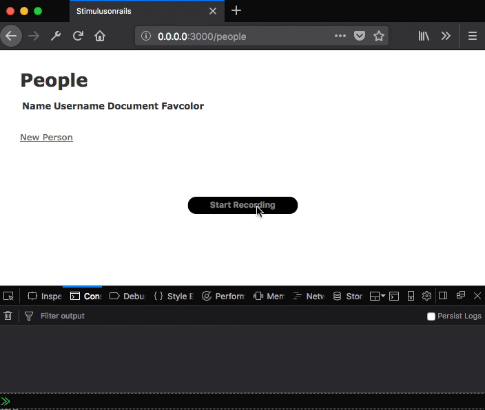

#  Ruby On Rails and Stimulus JS framework Application

This application was created to demonstrate how to integrate Ruby On Rails & Stimulus, a JavaScript framework.

Jump to [The Stimulus Handbook](https://github.com/stimulusjs/stimulus/blob/master/handbook/README.md) for a quick introduction.

You can see an online version of this app here [stimulusonrails.herokuapp.com](https://stimulus-people-form-example.herokuapp.com)

---
To clone and set up this project:
```
$ git clone https://github.com/sergiosouzalima/stimulusonrails.git
$ cd stimulusonrails
$ rails db:migrate
$ rails server
```

run this app, entering the following address in your browser address bar:

```
http://0.0.0.0:3000
```

Your app should work like that:



---

© 2018 Basecamp, LLC.
